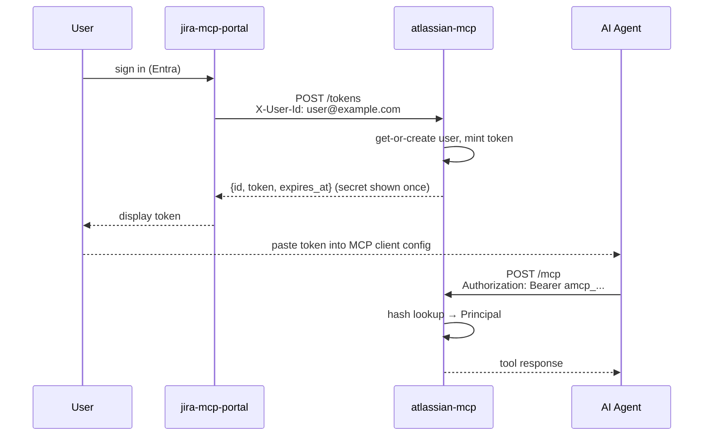
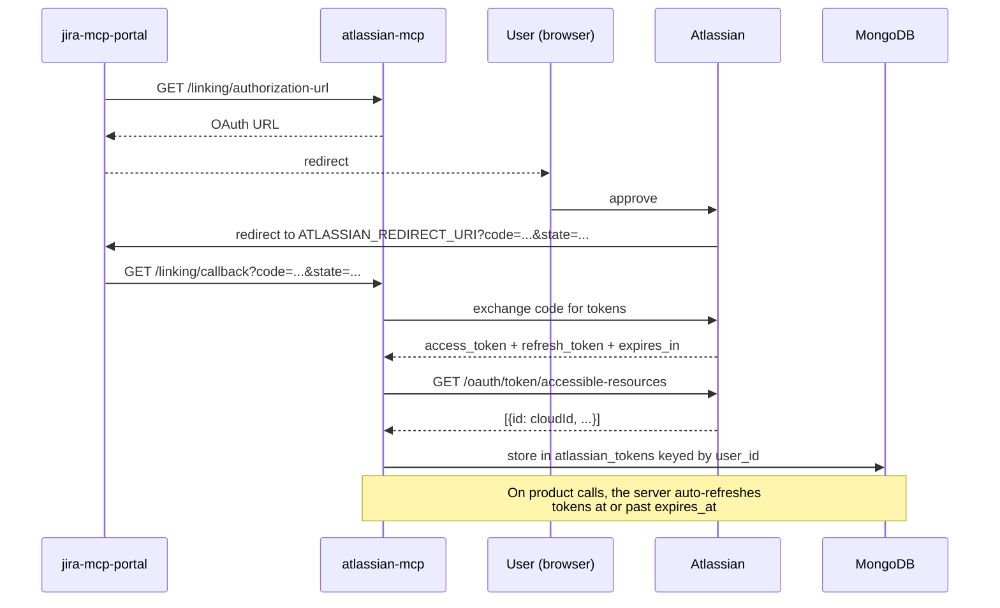

# atlassian-mcp

An MCP (Model Context Protocol) server that exposes [Jira](https://www.atlassian.com/software/jira) and [Confluence](https://www.atlassian.com/software/confluence) content to AI agents, behind a governed access-approval workflow. AI agents connect at `/mcp` using a bearer token and call MCP tools to search issues, read an issue, list pages, or read a page. The Atlassian account itself is connected up front through the portal, not by the agent.

Access is granted per **space or project key**, and separately **per product**: an Information Asset Owner can approve a space for Jira and refuse it for Confluence, or the other way round.

The companion frontend is [jira-mcp-portal](../jira-mcp-portal), which is the only intended caller of the REST surface described below.

## Requirements

- Python `>= 3.13`
- [uv](https://docs.astral.sh/uv/)
- Docker (for local MongoDB)

## Setup

```bash
uv sync
cp .env.example .env  # then fill in ATLASSIAN_CLIENT_ID, ATLASSIAN_CLIENT_SECRET, ATLASSIAN_REDIRECT_URI, BASE_URL
```

## Configuration

The app is configured via environment variables, managed by Pydantic `BaseSettings` in `app/config.py`. See `.env.example` for a filled-in starting point.

| Variable | Default | Description |
| :--- | :--- | :--- |
| `BASE_URL` | *(required)* | Public base URL of this server |
| `SERVER_NAME` | `atlassian-mcp` | Name reported by the MCP server |
| `PYTHON_ENV` | `None` | Set to `development` to enable hot-reload |
| `HOST` | `127.0.0.1` | Server host |
| `PORT` | `8085` | Server port |
| `LOG_CONFIG` | `None` | Path to a uvicorn logging config file |
| `MONGO_URI` | `None` | MongoDB connection URI |
| `MONGO_TRUSTSTORE` | `TRUSTSTORE_CDP_ROOT_CA` | Env var name holding a custom CA cert for the Mongo TLS connection, if set |
| `AWS_ENDPOINT_URL` | `None` | AWS endpoint override, e.g. for LocalStack in local dev |
| `HTTP_PROXY` | `None` | Outbound HTTP proxy URL |
| `TRACING_HEADER` | `x-cdp-request-id` | Request tracing header name |
| `RESOURCE_GUARD_MODE` | `config_list` | `config_list` denies a space unless its key is listed, per product, in the two CSV vars below — see [Config-driven resource guard](#config-driven-resource-guard). `allow_list` denies unless an approved request exists for the (user, space, product) triple — see [Space access requests](#space-access-requests). `allow_all` lets every request through |
| `RESOURCE_GUARD_ALLOWED_JIRA_PROJECTS` | *(required)* | Comma-separated Jira project keys allowed under `config_list` mode. May be set empty, but must be present — the server fails to start otherwise |
| `RESOURCE_GUARD_ALLOWED_CONFLUENCE_SPACES` | *(required)* | Comma-separated Confluence space keys allowed under `config_list` mode. May be set empty, but must be present — the server fails to start otherwise |
| `REST_AUTH_MODE` | `trusted` | `trusted` (network-asserted `X-User-Id` header) or `token` (personal access token) for REST/admin routes. `/mcp` and `/tokens` are unaffected — see [Auth](#auth) |
| `TRUSTED_USER_HEADER` | `X-User-Id` | Header the portal uses to assert the caller in `trusted` mode |
| `IDENTITY_DEFAULT_TTL_DAYS` | `90` | Default token lifetime |
| `IDENTITY_MAX_TTL_DAYS` | `365` | Longest lifetime a caller may request |
| `IDENTITY_LAST_USED_THROTTLE_SECONDS` | `300` | Minimum interval between `last_used_at` writes for the same token |
| `ATLASSIAN_AUTH_BASE` | `https://auth.atlassian.com` | Host serving the OAuth authorize and token endpoints |
| `ATLASSIAN_API_BASE` | `https://api.atlassian.com` | Host serving the product APIs and `/me` |
| `ATLASSIAN_CLIENT_ID` | *(required)* | Atlassian OAuth app client ID |
| `ATLASSIAN_CLIENT_SECRET` | *(required)* | Atlassian OAuth app client secret |
| `ATLASSIAN_REDIRECT_URI` | *(required)* | Absolute callback URL registered on the OAuth app. It points at the **portal**, not at this server — see [Atlassian OAuth](#atlassian-oauth-20-3lo-server--atlassian) |

Everything else about the Atlassian OAuth flow (authorize/token paths, audience, scopes), the Mongo database name, and every Mongo collection name is fixed in code, not configuration — there is exactly one value that would ever be used in any deployment.

Personal access tokens are always prefixed `amcp_`; that prefix is a code constant, not configuration, since changing it in production would invalidate every previously-minted token's prefix.

Local development uses a single root `.env` file, loaded by both `compose.yaml` and Pydantic directly. `.env` is gitignored.

## MCP Tools

The server exposes five tools to AI agents, resolved against the current `Principal` (see [Auth](#auth) — no `user_id` parameter is passed explicitly):

- **`list_spaces()`** — Lists the spaces and project keys the caller has requested, with the approval status of each for Jira and Confluence. The natural first call: it tells an agent what it is allowed to read.
- **`search_jira_issues(project_key, text=None, status=None, limit=25)`** — Searches issues in a project, most recently updated first. JQL is built server-side; the caller never supplies it.
- **`get_jira_issue(issue_key)`** — Returns one issue's fields and description. The project the guard checks comes from the key's own prefix (`FARM-123` → `FARM`), which Jira guarantees.
- **`list_confluence_pages(space_key, query=None, limit=25)`** — Lists pages in a space, most recently modified first.
- **`get_confluence_page(space_key, page_id)`** — Returns one page's content as text. The space key is a parameter so the guard can run before the page is fetched; the page is then verified to actually live in that space.

Connecting an Atlassian account is a frontend concern, not an MCP tool — the portal drives it via the REST routes under `/linking`.

## How it works

### Auth

The server uses two independent authentication layers.

#### Personal access tokens (AI agent → server)

atlassian-mcp mints its own bearer tokens rather than validating an external IdP's signature. The portal (which does authenticate the user via Entra) asserts the signed-in user's email via a trusted `X-User-Id` header against `POST /tokens`; the server uses that email verbatim as `user_id` — it mints no identifier of its own, only the opaque token (`amcp_...`) — and returns the plaintext secret exactly once — only its SHA-256 hash is ever persisted, so there is no endpoint that can return it again. The portal shows the token to the user, who pastes it into their MCP client.

Every request to `/mcp` (and, in `REST_AUTH_MODE=token`, the REST/admin surface) must carry `Authorization: Bearer <token>`. The server looks the token up by hash — no signature to verify, since it minted the token itself — and resolves it to a `Principal`.



Tokens can be listed and revoked via `GET /tokens` / `DELETE /tokens/{id}` (same trusted-header auth as minting).

#### Atlassian OAuth 2.0 3LO (server → Atlassian)

The server acts as an OAuth client toward Atlassian. Two things differ from a textbook flow, and both are required by Atlassian:

- The token endpoint takes a **JSON** body, not form encoding, and the authorize URL needs `audience=api.atlassian.com` (or the issued token cannot address the product APIs) and `prompt=consent` (or no refresh token is issued for `offline_access`).
- The **site** a token addresses — its "cloud id" — is not in the token response. It comes from a follow-up call to `/oauth/token/accessible-resources` and is stored alongside the token, then carried across refreshes.

The registered `redirect_uri` belongs to the **portal**, not to this server. Atlassian redirects the browser to the portal's callback page, which forwards the code and state to `GET /linking/callback` here with the usual trusted header. That is why `ATLASSIAN_REDIRECT_URI` is configuration rather than something derived from `BASE_URL`.



### Space access requests

Access is governed by `RESOURCE_GUARD_MODE`. In `allow_list` mode, a user must have an approved request for a given space **and product** before any tool will serve it.

There is exactly **one request document per (user, space)**, carrying an independent record per product:

```json
{
  "id": "req-1",
  "userId": "requester@defra.gov.uk",
  "spaceKey": "FARM",
  "reason": "Need this space for a workshop",
  "iao": "iao@defra.gov.uk",
  "products": {
    "jira":       { "requested": true,  "status": "approved",      "reviewerId": "iao@defra.gov.uk", "decisionReason": "No personal data", "decidedAt": "2026-08-22T09:00:00Z" },
    "confluence": { "requested": false, "status": "not-requested", "reviewerId": null,      "decisionReason": null,               "decidedAt": null }
  },
  "dataHandlingFormRef": "DH-1",
  "riskAssessmentRef": "RA-1",
  "createdAt": "2026-08-21T11:40:00Z"
}
```

Points worth knowing before changing any of this — the portal depends on all of them:

- **Both product keys are always present.** A product nobody asked for is stored as `{"requested": false, "status": "not-requested"}`, never omitted.
- **There is no top-level status.** A request has one status per product and none of its own; the portal derives "partly approved" itself, and a second definition here would compete with it. `partially-approved` is therefore never a stored or transmitted per-product value.
- **A decision covers one product.** Approving a space for both is two calls, and each leaves the other product exactly as it was.
- **Asking for a product later amends the same document.** Requesting Confluence for a space already approved for Jira keeps one record showing both, rather than opening a second, competing one. Re-requesting a product that is already `pending` or `approved` is a `409`; a `rejected` one can be asked for again.

The routes:

- `POST /approvals/spaces` — the user requests access to a space for one or both products, naming an Information Asset Owner (IAO) and a reason.
- `GET /approvals/spaces/{spaceKey}` — the user checks the status of their request.
- `GET /admin/access-requests` — the portal lists requests with at least one product still pending, for IAO review.
- `POST /admin/access-requests/{request_id}/approve` / `.../reject` — the portal records the IAO's decision for one product, including (for approvals) references to the data-handling form and risk assessment.

In `allow_all` mode, this workflow still records requests and decisions, but nothing is enforced — flip to `allow_list` only once the admin review workflow has real approvals to check against, since flipping first denies all traffic. This is a separate mode from `config_list` (the default) described next.

### Config-driven resource guard

`config_list` is the default `RESOURCE_GUARD_MODE`. Unlike `allow_list`, it has nothing to do with the access-request/admin-approval workflow above — there's no `SpaceAccessRequest`, no per-user decision, and nothing recorded through `/approvals` or `/admin/access-requests`. It's a static, hand-managed allow list: an operator sets `RESOURCE_GUARD_ALLOWED_JIRA_PROJECTS` and `RESOURCE_GUARD_ALLOWED_CONFLUENCE_SPACES` (comma-separated space/project keys) directly in config, and every user gets the same access. As with `allow_list`, approval is still **per product** — a key listed for Jira grants nothing in Confluence, even though the same key string is typically used for both. Matching is case-sensitive.

Both env vars are required — the server fails fast at startup if either is missing entirely, rather than silently denying everything under a default. A var may still be set to an empty value on purpose (that product is then denied for every space), but doing so logs a warning, since an accidentally empty var otherwise fails silently.

The portal can read the active mode and the current lists back via:

- `GET /admin/resource-guard/allowed-spaces` — returns `{"mode", "jiraProjects", "confluenceSpaces"}`, so it can show users what's currently allowed (and whether `config_list` is even the mode in effect).

### Wire format

Two conventions coexist deliberately, because the portal was written against both:

- `/approvals`, `/admin` and `/linking` are **camelCase**.
- `/tokens` is **snake_case** (`ttl_days`, `expires_at`, `last_used_at`, ...).

Status codes are load-bearing rather than decorative — the portal branches on them: `201` on create, `409` on a duplicate or an already-decided product, `404` on an unknown space/request/token, `400` on an OAuth state mismatch, `401` vs `502` on `/linking/test-connection`, `204` on token delete.

### Local development

There is no signature-verification bypass to enable — the server always looks up a real minted token. Mint one directly against the running service, using the trusted-header route the portal would otherwise call:

```bash
curl -X POST localhost:8085/tokens \
  -H "X-User-Id: dev@example.com" \
  -H "Content-Type: application/json" \
  -d '{"label": "local"}'
```

Use the returned `token` as a Bearer token against `/mcp` or any REST route.

### Content rendering

Jira issue descriptions and Confluence page bodies are both [Atlassian Document Format](https://developer.atlassian.com/cloud/jira/platform/apis/document/structure/). `app/integration/atlassian/content/adf.py` renders ADF to markdown-ish text, so one renderer serves both products — Confluence pages are fetched with `body-format=atlas_doc_format` for exactly that reason. The rendering is deliberately lossy: an LLM reading an issue wants the words, the headings and the list structure, not the mark spans. An unrecognised node type loses its formatting but never its content.

## Running locally

**Using Docker Compose** (starts MongoDB and the app):

```bash
docker compose up --build
```

The service runs on `http://localhost:8085`. Environment variables come from the root `.env` file (`env_file: - ".env"`).

**Running the app directly** (bring your own MongoDB, e.g. `docker compose up mongodb`):

```bash
uv run atlassian-mcp-http
```

This runs on `HOST:PORT` from your environment (default `127.0.0.1:8085`).

## Development tasks

```bash
# Lint and format check
uv run task lint

# Type check
uv run task typecheck

# Full test suite (lint + typecheck + pytest + coverage)
uv run task test

# Auto-fix formatting
uv run task format
```

## Testing

Tests are organized into `tests/unit/` and `tests/integration/` mirroring the `app/` directory structure. Filenames are unique across the whole `tests/` tree (there are no `__init__.py` files anywhere, so pytest resolves imports by basename).

### Running tests

```bash
# Everything except the tests needing a live MongoDB
uv run pytest -m "not mongo"

# Run all tests, including the testcontainers-backed Mongo round trips
uv run pytest

# Run a specific test file
uv run pytest tests/unit/integration/linking/test_oauth_client.py -vv

# Run with coverage
uv run coverage run -m pytest && uv run coverage report
```

Tests marked `@pytest.mark.mongo` start a real MongoDB via testcontainers and need Docker available.

### Integration tests with VCR

Some tests use [vcrpy](https://vcrpy.readthedocs.io/) to replay recorded HTTP interactions. Cassettes live in `tests/cassettes/` with credentials filtered.

```bash
# Re-record a cassette against the real vendor
VCR_RECORD_MODE=once uv run pytest tests/unit/integration/linking/test_oauth_api.py
```

**Important:** When re-recording cassettes, verify that credentials are properly filtered — `tests/unit/test_cassette_hygiene.py` enforces this, but check the YAML too.

## API endpoints

| Endpoint | Description |
| :--- | :--- |
| `POST /mcp` | MCP StreamableHTTP transport (bearer token required) |
| `GET /linking/authorization-url` | Atlassian OAuth 2.0 authorization URL for the portal to redirect the user to |
| `GET /linking/callback` | Completes the OAuth exchange with the code and state the portal forwards |
| `GET /linking/status` | Whether the caller has a stored Atlassian token |
| `GET /linking/test-connection` | Verifies the stored token against `GET /me` and returns the linked profile |
| `POST /tokens` | Mint a personal access token (trusted header) |
| `GET /tokens` | List the caller's personal access tokens (trusted header) |
| `DELETE /tokens/{id}` | Revoke a personal access token (trusted header) |
| `POST /approvals/spaces` | Request access to a space, for one or both products |
| `GET /approvals/spaces/{space_key}` | Check the status of a space access request |
| `GET /admin/access-requests` | List access requests awaiting IAO review (portal/IAO) |
| `POST /admin/access-requests/{request_id}/approve` | Approve one product on an access request |
| `POST /admin/access-requests/{request_id}/reject` | Reject one product on an access request |
| `GET /health` | Health check |
| `GET /docs` | Swagger UI |

The admin routes carry **no role check** — any authenticated principal can decide a request. They are expected to be reachable only from the portal over a private network, which is what actually restricts them.
